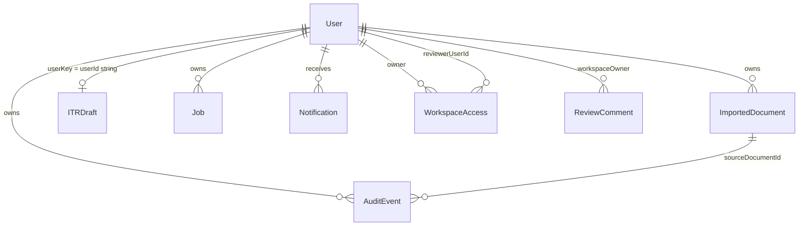

# TaxBee Database Design

**Version:** 0.1  
**Date:** 2026-05-31  
**Database:** MongoDB (Mongoose ODM)  
**Connection:** `MONGODB_URI` or legacy `MONGO_URI` — `backend/utils/env.js`

All schemas below are **verified from** `backend/models/*.js`. No invented collections.

---

## 1. Entity Relationship Overview



---

## 2. User

**Collection:** `users` (Mongoose model `User`)  
**File:** `backend/models/user.js`

| Field | Type | Notes |
|-------|------|-------|
| `name` | String | required |
| `email` | String | required, unique, lowercase |
| `password` | String | bcryptjs hashed on save |
| `role` | enum | `taxpayer`, `reviewer`, `ca`, `admin`, `internal` |
| `isVerified` | Boolean | email verification flag |
| `otpHash` | String | select: false |
| `otpExpiresAt` | Date | select: false |
| `passwordResetTokenHash` | String | select: false |
| `passwordResetExpiresAt` | Date | select: false |
| `createdAt`, `updatedAt` | Date | timestamps |

**Indexes:**
- `{ email: 1 }` unique
- `{ isVerified: 1, createdAt: -1 }`
- `{ otpExpiresAt: 1 }` sparse
- `{ role: 1, createdAt: -1 }`
- `{ passwordResetExpiresAt: 1 }` sparse

**Virtual:** `isEmailVerified` ↔ `isVerified`

---

## 3. ITRDraft

**Collection:** `itrdrafts`  
**File:** `backend/models/ITRDraft.js`

| Field | Type | Notes |
|-------|------|-------|
| `userKey` | String | required, **unique** — typically stringified user ObjectId |
| `salary` | Object | extensive Form 16 salary fields (strings) |
| `houseProperty` | Object | rent, municipal tax, loan interest |
| `pgbp` | Object | business income |
| `capitalGains` | Object | sale, cost, expenses |
| `otherSources` | Object | interest, dividend, other |
| `deductions` | Mixed | Chapter VI-A |
| `taxpayerProfile` | Mixed | PAN, employer metadata |
| `aisImport` | Mixed | legacy AIS snapshot |
| `extractionReview` | Mixed | array of reviewed fields |

**Indexes:** `{ userKey: 1 }` unique, `{ updatedAt: -1 }`

---

## 4. ImportedDocument

**Collection:** `importeddocuments`  
**File:** `backend/models/ImportedDocument.js`

| Field | Type | Notes |
|-------|------|-------|
| `userId` | ObjectId → User | required |
| `documentType` | enum | AIS, FORM_26AS, FORM_16, SALARY_SLIP, … UNKNOWN |
| `fileName` | String | required |
| `mimeType` | String | |
| `importedAt` | Date | |
| `reviewStatus` | enum | queued, processing, extracted, confirmed, overridden, failed |
| `detectedSections` | [String] | |
| `totals` | Object | tds, interest, dividend, salary, other |
| `extractedFields` | [ExtractedField] | embedded subdocs |
| `auditTrail` | [AuditEntry] | embedded change log |
| `extractedTextPreview` | String | max ~4000 chars in processing |
| `sourceMetadata` | Mixed | jobId, processingStatus, extraction/OCR meta |
| `rawPreview` | Mixed | optional raw parse preview |
| `deletedAt` | Date | soft delete |
| timestamps | | |

**ExtractedField sub-schema:**
- `fieldId`, `source`, `label`, `path`, `value`, `originalValue`
- `mappedSection`, `confidence`, `status` (extracted|confirmed|overridden)
- `userOverride`, `updatedAt`

**Indexes:**
- `{ userId: 1, importedAt: -1 }`
- `{ userId: 1, deletedAt: 1, importedAt: -1, createdAt: -1 }`
- `{ userId: 1, reviewStatus: 1, updatedAt: -1 }`
- `{ userId: 1, documentType: 1, importedAt: -1 }`

**Target S3 extension (not in schema today):**
```
sourceMetadata.s3Bucket   — UNKNOWN
sourceMetadata.s3Key      — UNKNOWN
sourceMetadata.s3VersionId — UNKNOWN
```

---

## 5. Job

**Collection:** `jobs`  
**File:** `backend/models/Job.js`

| Field | Type | Notes |
|-------|------|-------|
| `type` | enum | document_extraction, tax_intelligence_recalculation, audit_event_enrichment, email_invite, email_send, cleanup_stale_jobs |
| `status` | enum | queued, processing, completed, failed |
| `userId` | ObjectId | required |
| `priority` | Number | higher first |
| `attempts`, `maxAttempts` | Number | retry control |
| `failureReason` | String | |
| `lockedAt`, `lockedBy` | Date, String | worker claim |
| `runAfter` | Date | scheduled execution |
| `completedAt`, `failedAt`, `timeoutAt` | Date | |
| `inputRef` | Mixed | e.g. `{ importedDocumentId }` |
| `resultRef` | Mixed | job output references |
| `securePayload` | Mixed | **select: false** — AES-256-GCM encrypted upload payload |

**Indexes:** composite on status/runAfter/priority; userId+status; type+status

---

## 6. AuditEvent

**Collection:** `auditevents`  
**File:** `backend/models/AuditEvent.js`

| Field | Type | Notes |
|-------|------|-------|
| `userId` | ObjectId | required |
| `eventType` | enum | document_upload, field_extraction, field_confirmation, … job_failed |
| `entityType`, `entityId` | String | |
| `fieldKey` | String | indexed |
| `oldValue`, `newValue` | Mixed | |
| `sourceType` | enum | document, manual, import, system, assistant |
| `sourceDocumentId` | ObjectId | optional |
| `confidence` | Number | nullable |
| `actorType` | enum | user, system, assistant |
| `metadata` | Mixed | |
| `timestamp` | Date | createdAt alias |

**Indexes:** userId+timestamp, userId+fieldKey+timestamp, userId+eventType+timestamp, sourceDocumentId sparse

---

## 7. Notification

**Collection:** `notifications`  
**File:** `backend/models/Notification.js`

| Field | Type | Notes |
|-------|------|-------|
| `userId` | ObjectId | nullable |
| `recipientEmail` | String | required |
| `type` | enum | email_verification, reviewer_invite, import_job_*, filing_readiness_reminder, security_alert, … |
| `title`, `message` | String | |
| `status` | enum | unread, read |
| `emailStatus` | enum | not_queued, queued, sent, failed, skipped |
| `emailQueuedAt`, `emailSentAt` | Date | |
| `emailFailureReason` | String | |
| `readAt` | Date | |
| `metadata`, `dedupeKey` | Mixed, String | dedupe for spam prevention |

---

## 8. WorkspaceAccess

**Collection:** `workspaceaccesses`  
**File:** `backend/models/WorkspaceAccess.js`

| Field | Type | Notes |
|-------|------|-------|
| `ownerUserId` | ObjectId | taxpayer workspace owner |
| `reviewerEmail` | String | invite target |
| `reviewerUserId` | ObjectId | set on accept |
| `role` | enum | reviewer, ca, viewer |
| `status` | enum | invited, accepted, revoked |
| `permissions` | Object | viewDocuments, reviewFields, comment, approve, editDraft, viewAuditTimeline |
| `invitedAt`, `acceptedAt`, `revokedAt` | Date | |

---

## 9. ReviewComment

**Collection:** `reviewcomments`  
**File:** `backend/models/ReviewComment.js`

| Field | Type | Notes |
|-------|------|-------|
| `workspaceOwnerId` | ObjectId | |
| `reviewerUserId` | ObjectId | |
| `entityType`, `entityId` | String | optional linkage |
| `fieldKey` | String | |
| `comment` | String | max 3000 |
| `status` | enum | open, resolved |
| `resolvedAt` | Date | |
| `replies` | [CommentReply] | nested |

---

## 10. Caching (Non-Mongo)

**Tax context cache:** in-memory `Map` in `taxContextService.js`
- TTL: 30 seconds
- Max entries: 500
- Invalidated on import/draft changes

**Not Redis** — process-local only.

---

## 11. Index Maintenance

`DEPLOYMENT.md` recommends confirming indexes for:
User, ITRDraft, ImportedDocument, AuditEvent, Job, WorkspaceAccess, ReviewComment

Automated index migration scripts: **UNKNOWN**

---

## 12. Data Retention & GDPR

| Topic | Status |
|-------|--------|
| Soft delete imports | `deletedAt` on ImportedDocument |
| Hard delete / export user data | **UNKNOWN** |
| Atlas backup policy | Documented in DEPLOYMENT.md, not in code |

---

## 13. Future Schema Changes (Target — Not Applied)

When S3 is introduced, prefer:

1. Add `storageRef: { provider, bucket, key, etag }` on `ImportedDocument`
2. Remove raw base64 from `Job.securePayload` for new uploads
3. Keep `extractedFields` and audit linkage unchanged for backward compatibility

---

## References

- `backend/models/`
- `backend/services/jobQueueService.js`
- `docs/TRD.md`
