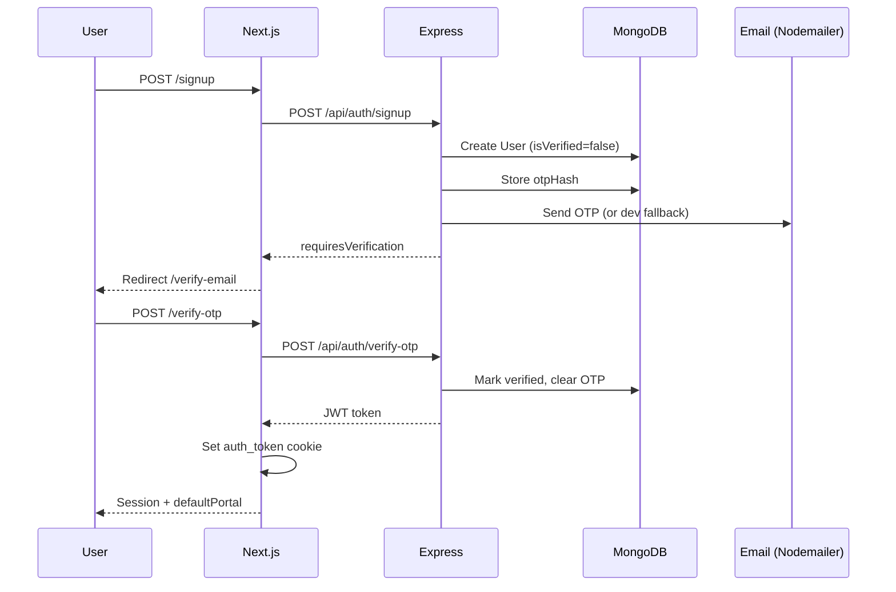
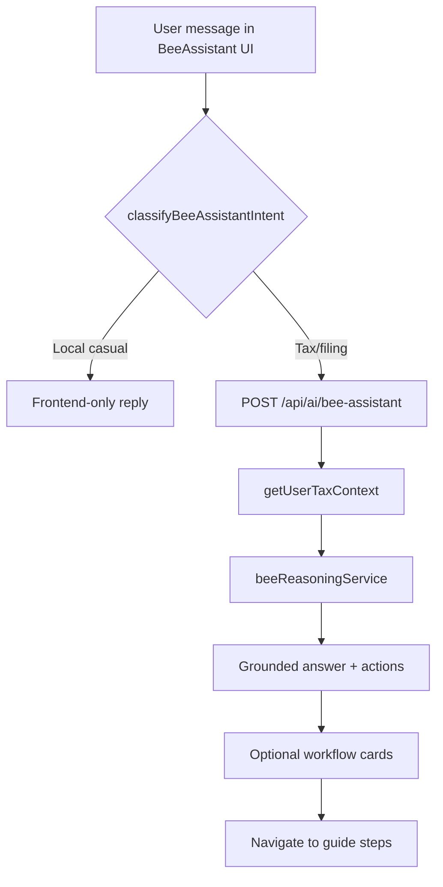
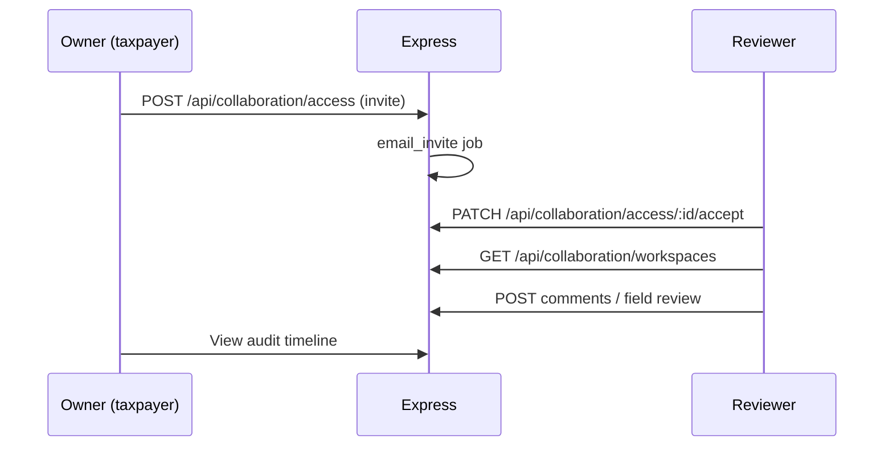

# TaxBee User Flows

**Version:** 0.1  
**Date:** 2026-05-31  
**Basis:** Implemented routes and pages in `app/`

---

## Flow 1: Signup & Email Verification



**Pages:** `app/signup/page.tsx`, `app/verify-email/page.tsx`  
**Backend:** `authController.signup`, `authController.verifyOtp`

**Edge cases:**
- Unverified login → 403 + new OTP (`authController.login`)
- Email provider missing → dev OTP in response (non-production only)

---

## Flow 2: Login & Dashboard

```mermaid
flowchart LR
  A[/login] --> B{Verified?}
  B -->|No| C[/verify-email]
  B -->|Yes| D[Set cookie]
  D --> E[/dashboard]
  E --> F[GET /api/dashboard]
  F --> G[Show draft, imports, intelligence]
```

**Pages:** `app/login/page.tsx`, `app/dashboard/page.tsx`  
**Session restore:** `app/_utils/authSession.ts` → `/api/auth/session`

**Protected routes (intended):** listed in `proxy.ts` — enforcement wiring UNKNOWN.

---

## Flow 3: Document Import & Extraction

```mermaid
flowchart TD
  A[/import-data] --> B[Select file / paste text]
  B --> C[POST /api/imports/upload]
  C --> D{Async?}
  D -->|PDF/image/large| E[202 + Job queued]
  D -->|Small text| F[201 sync extracted]
  E --> G[Worker: document_extraction]
  G --> H[Update ImportedDocument]
  H --> I[Job: tax_intelligence_recalculation]
  F --> I
  I --> J[Review fields on import-data UI]
  J --> K[PATCH /api/imports/:id/review]
```

**Primary UI:** `app/import-data/page.tsx`  
**Stub UI (non-functional):** `app/upload-documents/page.tsx`

**Review states:** `extracted → confirmed | overridden` on fields; document `reviewStatus` updated.

---

## Flow 4: ITR Draft & Regime Comparison

```mermaid
flowchart LR
  A[/file-your-itr] --> B[Edit salary, HP, PGBP, CG, OS]
  B --> C[Save draft]
  C --> D[PUT/POST itr-draft API]
  D --> E[(ITRDraft MongoDB)]
  A --> F[/dashboard or /tax-savings]
  F --> G[taxEngine regime compare]
  G --> H[Old vs New recommendation]
```

**Pages:** `app/file-your-itr/page.tsx`, `app/tax-savings/page.tsx`, `app/deductions/page.tsx`  
**Engine:** `backend/utils/taxEngine.js` (FY 2025-26)

---

## Flow 5: Bee Assistant Guidance



**Component:** `components/BeeAssistant.tsx`  
**Guides:** file ITR, upload docs, deductions — `backend/utils/BeeAssistantConfig.ts`

**Behavior rule (product):** Casual intents must not show filing workflow cards (`GEMINI.md`, intent gating).

---

## Flow 6: Collaboration (Reviewer / CA)



**Pages:** `app/collaboration/page.tsx`, `app/reviewer/workspaces/`  
**Permissions:** `WorkspaceAccess.permissions` (viewDocuments, reviewFields, etc.)

---

## Flow 7: Notifications

```mermaid
flowchart LR
  A[Job completed / security event] --> B[createNotification]
  B --> C[(Notification collection)]
  C --> D[/notifications page]
  D --> E[PATCH /api/notifications/:id/read]
```

**Types:** import_job_completed, filing_readiness_reminder, security_alert, reviewer_invite, etc.

---

## Flow 8: Audit Timeline

```mermaid
flowchart LR
  A[Field change / upload / job] --> B[recordAuditEvent]
  B --> C[(AuditEvent)]
  C --> D[GET /api/audit-timeline]
  D --> E[/audit-timeline UI]
  E --> F[Field provenance drill-down]
```

**API:** `/api/audit-timeline/value/:fieldKey`

---

## Flow 9: Final Filing (Partial)

```mermaid
flowchart TD
  A[/file-tax] --> B[Checklist + BeeAssistant]
  B --> C{Ready?}
  C -->|calculationStatus calculated| D[User proceeds manually]
  C -->|Not ready| E[Missing data prompts]
  D --> F[External: incometax.gov.in]
```

**Gap:** No in-app e-filing submission — user exits to government portal (`import-data/page.tsx` links).

---

## Flow 10: Logout

```
User → /logout or logoutSession()
  → POST /api/auth/logout
  → Clear auth_token cookie + localStorage token
  → Redirect /login
```

---

## Route Map (Implemented Pages)

| Path | Purpose |
|------|---------|
| `/` | Landing |
| `/signup`, `/login`, `/verify-email` | Auth |
| `/forgot-password`, `/reset-password` | Password recovery |
| `/dashboard` | Main workspace |
| `/import-data` | Document import + review |
| `/file-your-itr` | ITR draft editor |
| `/deductions` | Deductions |
| `/tax-savings` | Savings / regime |
| `/file-tax` | Filing checklist |
| `/documents` | Document list UI |
| `/audit-timeline` | Audit history |
| `/notifications` | Alerts |
| `/collaboration` | Invite reviewers |
| `/reviewer/workspaces` | Reviewer portal |
| `/admin/dashboard` | Admin (access gated by role) |
| `/upload-documents` | **Stub** — not wired to API |

---

## UNKNOWN Flows

- Payment/subscription purchase (`/pricing` exists — checkout flow UNKNOWN)
- Admin user management beyond dashboard page
- Automated n8n workflows post-filing

---

## References

- `docs/PRD.md`
- `docs/API_CONTRACTS.md`
- `REPOSITORY_AUDIT.md`
